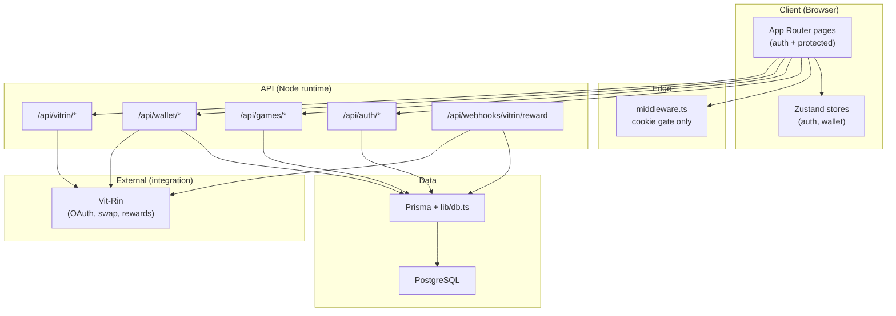
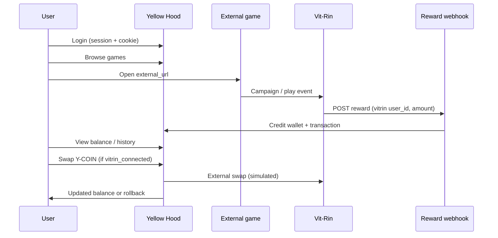

# Yellow Hood

**Gamified user acquisition and in-app wallet platform** — a reference implementation for product and growth teams that need session-based accounts, a reward ledger, game discovery, and external reward ingestion without outsourcing the entire stack to a third-party auth or gamification vendor.

---

## Overview

### What it is

Yellow Hood is a full-stack web application that combines **game discovery**, **session-based authentication**, and an **internal Y-COIN wallet** with optional **Vit-Rin** integration for OAuth-style linking, balance swaps, and webhook-driven rewards. It is built to demonstrate how acquisition funnels can close the loop from play → reward → balance → retention in a single deployable system.

### Why it exists

Growth and product teams often stitch together auth, a wallet or points layer, and campaign tooling from separate vendors. That works early, but it fragments ownership of the reward loop, complicates audit trails, and makes local or containerized demos painful. Yellow Hood provides a **cohesive, self-hosted baseline**: one schema, one API surface, and explicit transaction types so engineers can extend gamification rules without re-architecting auth or balances.

### Who it is for

| Audience | Use case |
| -------- | -------- |
| **Product & growth teams** | Prototype acquisition loops, reward webhooks, and wallet UX before committing to a larger platform |
| **Full-stack engineers** | Study App Router layout, Prisma data modeling, and edge-safe middleware patterns |
| **Platform / infra teams** | Run a reproducible Docker stack (Postgres + Next.js) for demos and integration tests |
| **Contributors** | Extend games, campaigns, analytics, or marketplace features on a documented foundation |

---

## Screenshots

Add captures under `public/screenshots/` (recommended filenames below). Until assets are added, paths serve as documentation placeholders.

| View | Path |
| ---- | ---- |
| Home / dashboard | `public/screenshots/home.png` |
| Game catalog | `public/screenshots/games.png` |
| Wallet & transactions | `public/screenshots/wallet.png` |
| Vit-Rin connect / swap | `public/screenshots/vitrin.png` |
| Settings & profile | `public/screenshots/settings.png` |

```markdown
<!-- Example embed once images exist -->


```

---

## Architecture

The system is organized into five layers. Each layer has a narrow responsibility; cross-cutting concerns (auth validation, DB access) stay in API routes and `lib/`, not in Edge middleware.



| Layer | Location | Responsibility |
| ----- | -------- | -------------- |
| **Frontend** | `app/(auth)`, `app/(protected)`, `components/` | Login/register, home, games grid, wallet dashboard, settings; client state via Zustand |
| **Edge routing** | `middleware.ts` | Redirect unauthenticated users away from protected paths; no DB or crypto |
| **API** | `app/api/**` | REST handlers: sessions, game list, balance, transactions, swap, Vit-Rin connect/OAuth, reward webhooks |
| **Domain / persistence** | `lib/db.ts`, `lib/auth.ts`, `prisma/schema.prisma` | Users, wallets, sessions, typed transactions, game catalog |
| **Integrations** | Vit-Rin routes & webhooks | Link external user IDs, credit rewards, simulate swap with rollback |

**Auth split:** Middleware checks the `auth_token` cookie only. API routes validate the same token via `Authorization: Bearer` and `getCurrentUser()` against the `sessions` table.

**Wallet split:** Balance lives on `wallets`; every credit/debit should produce a `transactions` row (`reward`, `swap`, `system`) for auditability.

---

## Core Systems

### Gamification engine

Gamification is not a separate microservice; it is **data + API contracts**:

- **Game catalog** — `Game` records (title, category, thumbnail, `external_url`) power discovery; the app deep-links users into external experiences.
- **Reward ingestion** — `POST /api/webhooks/vitrin/reward` accepts `user_id` (Vit-Rin ID), `amount`, and optional `source`, resolves the user, credits the wallet, and records a `reward` transaction.
- **Retention hooks** — Home and wallet surfaces expose balance and history so returning users see progress without a separate loyalty backend.

Extending the engine means adding campaign IDs, caps, or leaderboards on top of `transactions` and webhook payloads—without changing the auth or wallet primitives.

### Wallet system

Each user gets a **1:1 `Wallet`** at registration (created in the same Prisma transaction as the user).

| Concept | Implementation |
| ------- | ---------------- |
| Currency | Y-COIN (in-app `balance` on `wallets`) |
| Reads | `GET /api/wallet/balance`, `GET /api/wallet/transactions` |
| Outbound swap | `POST /api/wallet/swap` — debits locally, calls simulated Vit-Rin API, **rolls back** balance on failure, then writes `swap` transaction |
| Inbound reward | Webhook or future campaign jobs — `updateBalance` + `addTransaction` |

Transaction types are stored as strings (`reward`, `swap`, `system`) with `amount`, `status`, and optional `source` for reporting and future analytics.

### Authentication flow

Custom **session tokens**, not JWT-as-primary-session:

1. **Register** — `POST /api/auth/register` hashes password with **bcryptjs**, creates user + wallet.
2. **Login** — `POST /api/auth/login` verifies password, creates `Session` (24h), returns JSON `{ token, user }` and sets **httpOnly** `auth_token` cookie.
3. **API calls** — Client sends `Authorization: Bearer <token>`; `getCurrentUser()` loads session and user (including wallet).
4. **Logout** — `POST /api/auth/logout` invalidates session and clears cookie.
5. **Route protection** — Middleware redirects to `/login` if cookie missing on `/home`, `/wallet`, `/games`, `/settings`, etc.

Password hashing uses **bcryptjs** (pure JS) for reliable Docker Alpine and Apple Silicon builds without native `bcrypt` compilation.

### Game loop mechanics



1. Authenticated user opens the **games** catalog.
2. User launches a title via **external URL** (out of band).
3. Partner or Vit-Rin sends a **reward webhook** keyed by `vitrin_user_id`.
4. App **credits wallet** and appends a `reward` transaction.
5. User returns to **wallet/home** — balance and history reinforce the loop.
6. Optional **swap** moves Y-COIN out to Vit-Rin when `vitrin_connected` is true.

---

## User Flow

End-to-end path a growth engineer cares about:

```
Register / Login
    → Session cookie + Bearer token
    → Home (balance snapshot)
    → Games (discover → external play)
    → Reward webhook (async credit)
    → Wallet (history + swap if linked)
    → Settings / Vit-Rin connect
    → Repeat (retention loop)
```

| Step | User action | System behavior |
| ---- | ----------- | ----------------- |
| 1 | Sign up or log in | User + wallet created; session stored; cookie set |
| 2 | Land on home | Protected route; balance from wallet relation |
| 3 | Play via games | Catalog from DB; launch external experience |
| 4 | Earn reward | Webhook credits balance; `type: reward` transaction |
| 5 | Check wallet | List transactions; initiate swap if Vit-Rin linked |
| 6 | Connect Vit-Rin | OAuth-style flow stub (`/api/vitrin/connect`, oauth route) |
| 7 | Return later | Session + transaction history support retention |

---

## Tech Stack

| Layer | Technology |
| ----- | ---------- |
| Framework | **Next.js 14** (App Router) |
| Language | **TypeScript** |
| UI | **NextUI**, **Tailwind CSS**, **Framer Motion** |
| State | **Zustand** (`useAuthStore`, `useWalletStore`) |
| Database | **PostgreSQL** + **Prisma 7** (`@prisma/adapter-pg`) |
| Auth | Custom sessions + **bcryptjs** |
| HTTP client | **Axios** (`services/api.ts`) |
| Deployment | **Docker** + **Docker Compose** |

---

## Getting Started

### Prerequisites

- [Docker](https://docs.docker.com/get-docker/) and Docker Compose
- Optional: Node.js 20+ and local PostgreSQL for non-container development

### Quick start (Docker — recommended)

**1. Configure environment**

```bash
cp .env.example .env
```

Defaults work with Compose. Override `POSTGRES_*`, `NEXTJS_PORT`, or `DATABASE_URL` only if you deviate from the bundled stack.

**2. Build and start services**

```bash
docker compose up -d --build
```

| Service | Container | Port |
| ------- | ----------- | ---- |
| PostgreSQL | `yellow-hood-postgres` | `5432` |
| Next.js | `yellow-hood-nextjs` | `3000` |

**3. Initialize database**

```bash
docker compose exec nextjs npx prisma db push
docker compose exec nextjs npx prisma db seed
```

**4. Open the application**

[http://localhost:3000](http://localhost:3000)

**5. (Optional) Inspect data**

```bash
docker compose exec nextjs npx prisma studio
```

### Local development (without Docker)

1. Run PostgreSQL locally and set `DATABASE_URL` in `.env` (use `localhost`, not the Docker service hostname).
2. Install and sync:

```bash
npm install
npx prisma db push
npx prisma db seed
npm run dev
```

3. App runs at [http://localhost:3000](http://localhost:3000).

### Test accounts

After seeding, all demo users share the password `password123`:

| Email | Vit-Rin | Balance (Y-COIN) |
| ----- | ------- | ---------------- |
| `john.doe@example.com` | Connected | 1500.50 |
| `jane.smith@example.com` | Not connected | 750.25 |
| `alice.wonder@example.com` | Connected | 2000.00 |
| `bob.builder@example.com` | Not connected | 100.00 |

### Useful commands

| Command | Description |
| ------- | ----------- |
| `docker compose up -d --build` | Start Postgres + app |
| `docker compose exec nextjs npx prisma db push` | Apply schema |
| `docker compose exec nextjs npx prisma db seed` | Load demo users, games, transactions |
| `docker compose exec nextjs npx prisma studio` | Database UI |
| `docker compose down` | Stop containers |
| `npm run db:push` / `npm run db:seed` | Local Prisma workflows |

---

## Project Structure

```
yellow-hood-app/
├── app/
│   ├── (auth)/              # Login, register
│   ├── (protected)/         # Home, games, wallet, settings
│   ├── api/
│   │   ├── auth/            # login, register, logout, update
│   │   ├── games/           # catalog
│   │   ├── wallet/          # balance, transactions, swap
│   │   ├── vitrin/          # connect, oauth
│   │   └── webhooks/vitrin/ # reward ingestion
│   └── layout.tsx
├── components/
│   ├── games/               # GameCard
│   ├── layout/              # Navbar, BottomNav
│   └── wallet/              # Dashboard, swap, connect
├── lib/
│   ├── auth.ts              # Bearer session validation
│   ├── db.ts                # Prisma domain helpers
│   └── prisma.ts
├── prisma/
│   ├── schema.prisma
│   └── seed.ts
├── services/                # API client wrappers
├── store/                   # Zustand
├── public/screenshots/      # UI captures (add your own)
├── docker-compose.yml
├── Dockerfile
└── middleware.ts            # Edge cookie gate
```

---

## Design Decisions

### Why Prisma

- **Schema as contract** — Users, wallets, sessions, transactions, and games are explicit models with indexes on `sessions.token` and `transactions.user_id`.
- **Transactional integrity** — User registration creates wallet in one `$transaction`; swap flow debits then rolls back on external failure.
- **Prisma 7 + `adapter-pg`** — Driver adapter over `pg` Pool fits containerized Postgres and keeps generate/migrate tooling standard for contributors.

### Why Docker

- **Reproducible demos** — One command brings up Postgres and the Next.js image with a correct internal `DATABASE_URL` (`postgres` hostname on the Compose network).
- **No native bcrypt pain** — Alpine-based images stay reliable with bcryptjs; no per-machine native module builds for evaluators cloning the repo.
- **Production-shaped local env** — `NODE_ENV=production` in the app container mirrors deploy constraints while still allowing `prisma db push` and seed via `exec`.

### Why custom auth instead of third-party auth

- **Full control of the reward loop** — Sessions tie directly to `users` and `wallets`; no vendor user ID mapping layer for webhooks.
- **Predictable API auth** — Same token in cookie (UX) and `Authorization` header (XHR) simplifies mobile or SPA clients later.
- **Edge-safe middleware** — No OAuth redirect complexity or JWKS fetches on Edge; only cookie presence is checked at the edge, validation stays in Node API routes.
- **Teachable baseline** — Teams see password hashing, session expiry, and revocation in-repo rather than behind a hosted dashboard.

Trade-off: you own password reset, MFA, and rate limiting—appropriate for a platform reference, not a statement that OAuth providers are avoided in production forever.

### bcryptjs instead of bcrypt

Pure JavaScript hashing avoids native compilation failures on Docker Alpine and mixed ARM/x64 developer machines. Security parameters remain standard (cost factor 10 on hash).

### Edge-compatible middleware

`middleware.ts` performs **no** Prisma, bcrypt, or Node-only APIs—only cookie checks and redirects. All authorization truth lives in API routes via `getCurrentUser()`.

---

## API Surface (reference)

| Method | Path | Purpose |
| ------ | ---- | ------- |
| POST | `/api/auth/register` | Create user + wallet |
| POST | `/api/auth/login` | Issue session + cookie |
| POST | `/api/auth/logout` | Revoke session |
| GET | `/api/games/list` | Game catalog |
| GET | `/api/wallet/balance` | Current Y-COIN balance |
| GET | `/api/wallet/transactions` | Ledger history |
| POST | `/api/wallet/swap` | Debit + Vit-Rin swap (with rollback) |
| POST | `/api/vitrin/connect` | Start Vit-Rin link |
| POST | `/api/webhooks/vitrin/reward` | Credit rewards by Vit-Rin user ID |

Protected routes expect `Authorization: Bearer <session_token>` unless using cookie-backed navigation from the browser.

---

## Roadmap

Planned evolution from reference app to **extensible gamification platform**:

| Phase | Focus |
| ----- | ----- |
| **Platform core** | Campaign and rules engine (budgets, caps, cooldowns) driven off `transactions` |
| **Analytics module** | Funnel metrics: register → first game → first reward → swap; export or dashboard |
| **Reward marketplace** | Catalog of redeemable rewards; spend Y-COIN inside app |
| **Multi-campaign support** | Namespaced campaigns, A/B flags, per-game attribution on webhooks |
| **Hardening** | Webhook signatures, rate limits, MFA, structured audit logs |

Contributions aligned with these areas are welcome; open an issue before large schema changes.

---

## Contributing

1. Fork the repository and create a feature branch.
2. Run the Docker quick start (or local Postgres) and confirm `prisma db push` + seed succeed.
3. Keep middleware Edge-safe; add DB logic in `lib/db.ts` or API routes.
4. Document new env vars in `.env.example` and update this README for user-visible behavior.

---

## License

Specify your license in `LICENSE` (e.g. MIT) before public distribution. Until then, treat the repository as source-available for evaluation and internal extension.
